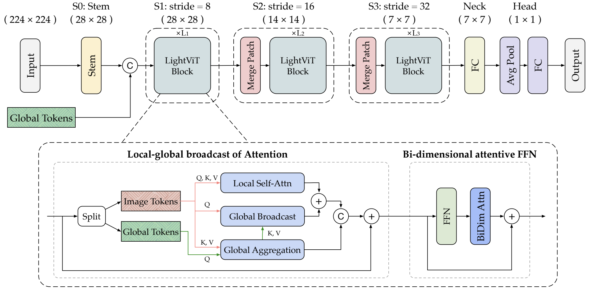

# LightViT
Official implementation for paper "[LightViT: Towards Light-Weight Convolution-Free Vision Transformers](https://arxiv.org/abs/2207.05557)".

By Tao Huang, Lang Huang, Shan You, Fei Wang, Chen Qian, Chang Xu.


## Updates  
### July 14, 2022  
Code for ImageNet training was released.


## Introduction  
<p align='center'>

</p>

## Results on ImageNet-1K  

|model|resolution|acc@1|acc@5|#params|FLOPs|ckpt|log|
|:--:|:--:|:--:|:--:|:--:|:--:|:--:|:--:|
|LightViT-T|224x224|78.7|94.4|9.4M|0.7G|[google drive](https://drive.google.com/file/d/1NasAnHYK6bkmj0-rzYvxQSEUiKAOW3j9/view?usp=sharing)|[log](https://github.com/hunto/LightViT/releases/download/v0.0.1/log_lightvit_tiny.csv)|
|LightViT-S|224x224|80.9|95.3|19.2M|1.7G|[google drive](https://drive.google.com/file/d/16EZUth-wZ7rKR6tI67_Smp6GGzaODp16/view?usp=sharing)|[log](https://github.com/hunto/LightViT/releases/download/v0.0.1/log_lightvit_small.csv)|
|LightViT-B|224x224|82.1|95.9|35.2M|3.9G|||

### Preparation  
1. Clone training code  
    ```shell
    git clone https://github.com/hunto/LightViT.git --recurse-submodules
    cd LightViT/classification
    ```

    **The code of LightViT model can be found in [lib/models/lightvit.py](https://github.com/hunto/image_classification_sota/blob/main/lib/models/lightvit.py)** .

2. Requirements  
    ```shell
    torch>=1.3.0
    # if you want to use torch.cuda.amp for mixed-precision training, the lowest torch version is 1.5.0
    timm==0.5.4
    ```
3. Prepare your datasets following [this link](https://github.com/hunto/image_classification_sota#prepare-datasets).

### Evaluation  
You can evaluate our results using the provided checkpoints. First download the checkpoints into your machine, then run
```shell
sh tools/dist_run.sh tools/test.py ${NUM_GPUS} configs/strategies/lightvit/config.yaml timm_lightvit_tiny --drop-path-rate 0.1 --experiment lightvit_tiny_test --resume ${ckpt_file_path}
```

### Train from scratch on ImageNet-1K
```shell
sh tools/dist_train.sh 8 configs/strategies/lightvit/config.yaml ${MODEL} --drop-path-rate 0.1 --experiment lightvit_tiny
```
${MODEL} can be `timm_lightvit_tiny`, `timm_lightvit_small`, `timm_lightvit_base` . 

For `timm_lightvit_base`, we added `--amp` option to use mixed-precision training, and **set `drop_path_rate` to 0.3**.

### Throughput
```shell
sh tools/dist_run.sh tools/speed_test.py 1 configs/strategies/lightvit/config.yaml ${MODEL} --drop-path-rate 0.1 --batch-size 1024
```
or
```shell
python tools/speed_test.py -c configs/strategies/lightvit/config.yaml --model ${MODEL} --drop-path-rate 0.1 --batch-size 1024
```

## License  
This project is released under the [Apache 2.0 license](LICENSE).

## Citation  
```
@article{huang2022lightvit,
  title = {LightViT: Towards Light-Weight Convolution-Free Vision Transformers},
  author = {Huang, Tao and Huang, Lang and You, Shan and Wang, Fei and Qian, Chen and Xu, Chang},
  journal = {arXiv preprint arXiv:2207.05557},
  year = {2022}
}
```